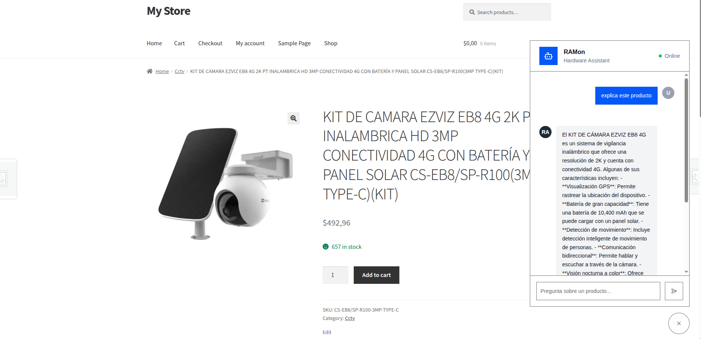

# RAMon

AI chatbot for technical assistance on ecommerce sites. Provides a floating chat bubble that customers can interact with for product support and recommendations.



## Architecture

RAMon is organized as a set of independent sub-projects. Each folder is self-contained with its own dependencies, configuration, and README.

```
code/
├── backend/         # FastAPI API that powers the chatbot
├── chatbot/         # LangGraph chatbot logic (Python library)
├── cli/             # CLI scripts for testing the chatbot without the web interface
├── deploy/          # Docker Compose and deployment configuration
├── frontend/        # Chat bubble widget (TypeScript/Vite)
├── integrations/    # Platform integrations (e.g. WordPress plugin)
└── tools/           # Dev scripts and utilities (DB tools, scrapers)
```

### backend/

FastAPI API that serves the chatbot. Handles incoming messages, manages sessions, and returns responses from the LangGraph graph. See [backend/README.md](backend/README.md).

### chatbot/

Python library containing the LangGraph chatbot logic. Defines the graph, nodes, and tools used by the backend. See [chatbot/README.md](chatbot/README.md).

### cli/

Standalone scripts that use the chatbot library directly. Useful for quick testing and debugging without spinning up the web server. See [cli/README.md](cli/README.md).

### deploy/

Docker Compose files, nginx config, and scripts for deploying the API in production. See [deploy/DEPLOYMENT.md](deploy/DEPLOYMENT.md).

### frontend/

The chat bubble widget built with TypeScript and Vite. Produces `dist-widget/` with the bundled JS and fonts that gets served to end users. See [frontend/README.md](frontend/README.md).

### integrations/

Ecommerce platform integrations. Currently includes a WordPress plugin (`wp-ramon-chatbot`) that injects the chat bubble into WooCommerce sites. See [integrations/wp-ramon-chatbot/README.md](integrations/wp-ramon-chatbot/README.md).

### tools/

Miscellaneous dev scripts for database operations, web scraping, and other tasks. See [tools/](tools/).

## Environment Variables

Each sub-project that requires configuration has its own `.env.example` file documenting the required variables:

| Sub-project | Config file |
|-------------|-------------|
| backend | [backend/.env.example](backend/.env.example) |
| cli | [cli/.env.example](cli/.env.example) |
| frontend | [frontend/.env.example](frontend/.env.example) |
| tools | [tools/db_tools/.env.example](tools/db_tools/.env.example) |

Copy each `.env.example` to `.env` and fill in the values before running that sub-project.
