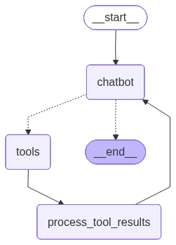

# RAMon Backend

The RAMon backend exposes a FastAPI application that orchestrates a LangGraph-powered
chatbot for product discovery in an online hardware store. It bundles a lightweight
demo UI (`index.html`) and a WebSocket API that streams conversational updates to the
frontend as the agent thinks and calls tools.

## LangGraph Architecture

The assistant is implemented as a LangGraph state machine with a few purposeful nodes:

- `chatbot` routes user messages through an OpenAI model primed with the system prompt
  and current product context.
- `tools` wraps LangChain tools (search, recommendations) via `ToolNode` and is invoked
  whenever the model issues tool calls.
- `process_tool_results` extracts structured product recommendations so the UI can render
  curated results.



The graph starts at `chatbot`, optionally loops through `tools` and
`process_tool_results`, and finally emits structured snapshots that the WebSocket handler
forwards to the client.

## Getting Started

### 1. Configure environment variables

Create a `.env` file (or export the variables) with the credentials and settings. See the `.env.example` for more info


### 2. Install dependencies

```bash
python -m venv .venv
source .venv/bin/activate
pip install --upgrade pip
pip install -r requirements.txt
```

### 3. Run the server

```bash
uvicorn server:app --reload --port 8080
```

The root route (`/`) serves the demo UI. Open `http://localhost:8080` to start a session.

### 4. Access API documentation

Open `http://localhost:8080/docs` to see HTTP endpoint documentation


## WebSocket Protocol

Clients connect to `/ws?chat_id=<session-id>` and exchange UTF-8 text frames. Outgoing
frames should be JSON objects with:

- `message` (string, required): the user input.
- `current_product_id` (string, optional): catalog identifier that enriches the context.

If a plain string is sent, the server treats it as the `message` with no current product.
Responses are JSON snapshots mirroring the LangGraph stream; they contain assistant
tokens plus any structured `ui_payload` entries for the frontend.
