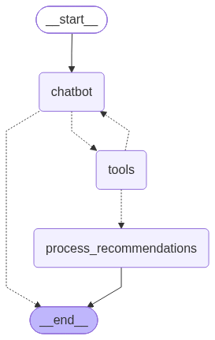

# RAMon Chatbot

Shared chatbot library for RAMon - a technical assistance chatbot for computer e-commerce.

This package provides the core chatbot functionality using LangGraph, OpenAI, Pinecone,
and Tavily. It is designed to be used by both the backend server and CLI tools.

## Architecture

The package follows clean architecture principles with three layers:

```
chatbot/
├── domain/           # Core domain models (Product, AgentState)
├── application/      # Business logic (ChatbotService, graph workflow)
└── infrastructure/   # External adapters (Pinecone catalog, LangGraph tools)
```

### LangGraph Workflow

The chatbot is implemented as a LangGraph state machine:



- `chatbot` - Routes messages through OpenAI with system prompt and product context
- `tools` - Executes LangChain tools (product search, web search)
- `process_tool_results` - Extracts structured recommendations for UI rendering

## Installation

Install in editable mode from another project (e.g., backend or cli):

```bash
pip install -e ../chatbot
```

Or add to requirements.txt:

```
-e ../chatbot
```

## Quick Start

```python
from chatbot import create_chatbot

# Create chatbot with default settings (loads from environment)
bot = create_chatbot()

# Simple query
result = bot.invoke("Recommend a gaming laptop under $1000")
print(result["messages"][-1].content)
```

## API Reference

### Factory Functions

```python
from chatbot import create_chatbot, build_chatbot_components

# Simple initialization (uses MemorySaver for state)
bot = create_chatbot()

# Full control over initialization
from chatbot import ChatbotSettings, build_chatbot_components
from langgraph.checkpoint.postgres.aio import AsyncShallowPostgresSaver

settings = ChatbotSettings.from_env()
async with AsyncShallowPostgresSaver.from_conn_string(settings.database_url) as saver:
    components = build_chatbot_components(settings, saver)
    service = components.service
    catalog = components.product_catalog
```

### ChatbotService

```python
# Synchronous invocation
result = bot.invoke(
    message="Find me a 4K monitor",
    current_product=None,  # Optional product context
    chat_id="session-123",
)

# Async streaming
async for chunk in bot.stream(message="...", chat_id="..."):
    print(chunk)

# Get chat history
history = await bot.get_chat_history("session-123")
```

### Domain Models

```python
from chatbot import Product, AgentState

product: Product = {
    "id": "prod-001",
    "name": "Product Name",
    "description": "Product description",
    "price": 99.99,
    "url": "/products/prod-001",
}
```

### Graph Visualization

Generate a PNG image of the LangGraph workflow:

```python
from chatbot import create_chatbot, save_graph_image

bot = create_chatbot()
save_graph_image(bot, "graph.png")
```

Or get the raw bytes:

```python
from chatbot import create_chatbot, generate_graph_image

bot = create_chatbot()
png_bytes = generate_graph_image(bot)
```
